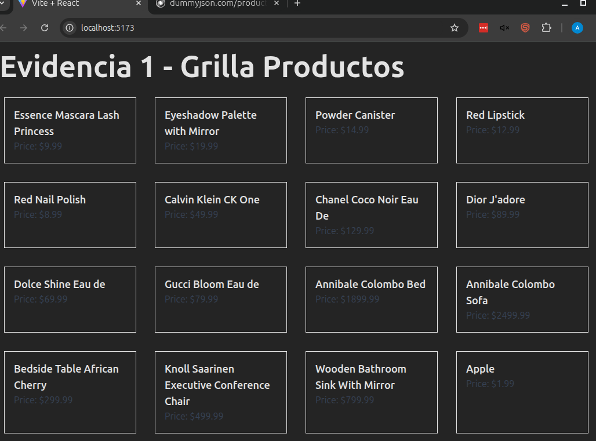

# Configuración e Instrucciones

Este proyecto es una aplicación Vite+React que sirve como base de las evidencias 1 y 2. A continuación, se detallan los pasos para configurar y ejecutar el proyecto localmente.

## Requisitos

Asegurarse de tener instalado nodey npm (generalmente inncluído con node):

- [Node.js](https://nodejs.org/) (versión 14 o superior)

## Instalación

1. Clonar este repositorio localmente.
2. Navega hasta el directorio del proyecto:

   ```bash
   cd evidencias1y2
   ```

3. Instalar las dependencias:

   ```bash
   npm install
   ```

## Ejecutar del server

1. Inicializar el servidor en modo de desarrollo:

   ```bash
   npm run dev
   ```

2. Abrir el navegador haciendo Crtl+click sobre el enlace proporcionado en la terminal (generalmente `http://localhost:5173`).


## Notas

- En este proyecto se utilizó Tailwind CSS para los estilos.
- Axios se utiliza para realizar solicitudes HTTP.

## Resultado según el avance de cada evidencia.

1. Como resultado de la evidencia 1, se realizó la instalación de los módulos y una grilla de productos básica. 

2. Como resultado de la evidencia 2, se agregaron filtros dinámicos, estadísticas (que se calculan sobre los items filtrados), modularización en componentes y mejoras en la visualización. 

2.1 En esta sección se implementaron estadísticas dinámicas que se calculan sobre los productos filtrados, se incluye:

- **Producto más caro:** Muestra el producto con el precio más alto.
- **Producto más barato:** Muestra el producto con el precio más bajo.
- **Cantidad de productos con títulos largos:** Cuenta los productos cuyo título tiene más de 20 caracteres.
- **Descuento promedio:** Calcula el promedio de los descuentos de los productos filtrados.
- **Mayor y menor descuento:** Identifica los productos con el mayor y menor porcentaje de descuento.
- **Rango de precios:** Muestra el precio mínimo y máximo entre los productos filtrados.

2.2 El código fse modularizó en los siguientes componentes para mejorar su organización y facilitar reutilización:

Se identifica una fracción del código que tiene una responsabilidad específica. Luego, se crea un nuevo archivo para ese componente y se mueve el código correspondiente

Se pasan los props desde el componente principal para que el nuevo componente pueda recibir los datos necesarios. Por ejemplo, en el caso de `StatsPanel`, se le envían los productos filtrados como prop para que calcule y muestre las estadísticas.

- **FirstComponent:** Componente principal que gestiona la búsqueda y el filtrado de productos.
- **StatsPanel:** Se encarga dde mostrar las estadísticas dinámicas calculadas sobre los productos filtrados.
- **ProductList:** Renderiza los productos filtrados en una grilla